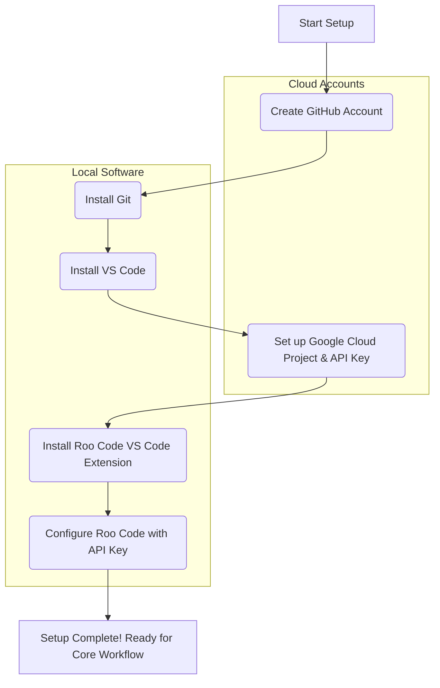

# Chapter 2: Essential Setup: Accounts & Installations

This chapter is all about getting your digital toolkit ready. The following steps involve creating accounts and installing software. While it might seem like a lot of "gruelling setup," as described in the workshop, remember that most of this is a **one-time process**. Once completed, you'll have a powerful and largely free environment for your creative technology projects.

We'll cover:

1.  **[Creating Your GitHub Account](./02_a_github_account.md):** Your passport to the world of collaborative development and open source.
2.  **[Installing Git & VS Code](./02_b_install_git_vscode.md):** The core version control tool and your primary code editor.
3.  **[Setting up a Google Cloud API Key](./02_c_gcp_api_key.md):** Unlocking free access to powerful AI models like Google Gemini.
4.  **[Configuring Roo Code in VS Code](./02_d_roo_code_config.md):** Integrating the AI into your editor for an enhanced workflow.

The workshop highlighted that navigating these setups can sometimes be "janky" or "heinously complicated" due to ever-changing interfaces. This guide aims to provide a clear path. Don't worry if you encounter slight variations; the core principles remain the same. The key is to get these foundational pieces in place so you can move on to the exciting parts: creating, collaborating, and "vibe coding."

Let's break down the setup process step-by-step.

Take your time with each section. The recording of the original workshop and these notes are here to help if you get stuck. The goal is to emerge with a fully functional development environment.

---

First up: [2a. Creating Your GitHub Account](./02_a_github_account.md)